## Table of Contents

<TOCInline toc={props.toc} exclude="Table of Contents" />

## Çok Değişkenli Linear Regresyon

İlk sürümde, evin boyutu özelliği (x) kullanılarak evin fiyatını tahmin etmeye çalışıyorduk. Modelimiz $f_w,b(x) = wx + b$ şeklindeydi. Ancak şimdi, evin fiyatını tahmin etmek için sadece boyut değil, aynı zamanda oda sayısı, kat sayısı, evin yaşı gibi birden fazla özelliğimiz olduğunu düşünelim. Bu durumda daha fazla bilgiye sahip olmak, fiyat tahminini daha doğru hale getirebilir. Dolayısıyla, 4 farklı özelliği belirtmek için $X₁, X₂, X₃$ ve $X₄$ gibi yeni bir gösterim tanıtacağız.

**Notasyon**

| Size in Feet² (X₁) | Number of bedrooms (X₂) | Numbur of floors (X₃) | Age of home in year (X₄) | Price ($) in $1000's (y) | Example                           |
| ------------------ | ----------------------- | --------------------- | ------------------------ | ------------------------ | --------------------------------- |
| 2104 $x^1₁$        | 5 $x^1₂$                | 1                     | 45                       | 460                      |                                   |
| 1416               | 3 $x^2₂$                | 2                     | 40                       | 232                      | $x^²$ $= [1416,3,2,40]$ $x²₃ = 2$ |
| 1534               | 3 $x^3₂$                | 2                     | 30                       | 315                      |                                   |
| 852                | 2 $x^4₂$                | 1 $x^4₃$              | 36 $x^4₄$                | 178                      |                                   |
| ...                | ... $xⱼ^i$              | ...                   | ...                      | ...                      |                                   |
| 452                | 3 $x^n₂$                | 2                     | 34                       | 270                      |                                   |

| Notasyon | Açıklama                                                                                                                      | Örnek                    |
| -------- | ----------------------------------------------------------------------------------------------------------------------------- | ------------------------ |
| $xⱼ$     | x'inci özelliği ifade eder                                                                                                    | $j = 1..4$               |
| $n$      | özellik sayısı                                                                                                                | n=4                      |
| $x^i$    | üzeri oklu semboller genellikle vektör olduğunu ifade eder. Bu sembol ise i'inci eğitim örneğinin özelliklerini ifade ediyor. | $x^² = [1416, 3, 2, 40]$ |
| $xⱼ^i$   | i'inci eğitim örneğindeki j özelliğinin değeri                                                                                | $x^4₃ = 1$               |

Her bir özellik için $x_j$ ifadesi kullanılır. Burada $j$, özelliğin numarasını ifade eder ve $1$'den $4$'e kadar gider, çünkü toplamda $4$ özelliğimiz bulunmaktadır. Toplam özellik sayısını ifade etmek için küçük $n$ harfini kullanacağız. Bu örnekte, $n$ değeri $4$'e eşittir. Eğitim örneği hakkında konuşurken ise $x^{(i)}$ ifadesini kullanacağız. Burada $x^{(i)}$, $i$'inci eğitim örneğinin tüm özelliklerini içeren bir vektörü ifade eder.

Örneğin, $x^{(2)}$ ifadesi, ikinci eğitim örneğinin özelliklerini içeren bir vektörü temsil eder. Bu vektör teknik olarak $[1416, 3, 2, 40]$ sayılarını içerir. Sayıları sırayla yazıyorum. Bu vektörü sütun veya satır olarak kullanabiliriz; bu aralarındaki fark bizim için önemsizdir.

İkinci örnekteki üçüncü özellik hakkında konuşurken $x^{(2)}_3$ ifadesini kullanacağız. Bu özellik, ikinci örneğin kat sayısını temsil eder ve $2$ sayısına eşittir. $x^{(2)}$ ifadesinin bir sayı olmadığını, sayıları içeren bir vektör olduğunu vurgulamak için ok işareti üzerine bir vektör sembolü ekleyebiliriz. Bu sembol, görsel olarak bir vektör olduğunu ifade eder.

**Model**

Önceleri, modelimizi $x$ tek bir özelliğe, yani tek bir sayıya dayanarak tanımlıyorduk. Ancak şimdi birden fazla özelliğimiz var. Bu nedenle yeni bir tanımlama yapmamız gerekiyor. Yeni modelimiz aşağıdaki gibi olacak:

$$f w,b(x) = w₁x₁ + w₂x₂ + w₃x₃ +... + wₙxₙ + b$$

Bu modeli, ev fiyatını tahmin etmek için kullanabiliriz. Örneğin, evin boyutu için $0.1x_1$, odaların sayısı için $4x_2$, kat sayısı için $10x_3$ ve evin yaşı için $-2x_4$ kullanabiliriz. Ayrıca $b$ değeri de $80$ olarak belirlenir.

$$ fw,b(x) = 0.1x₁ + 4x₂ + 10x₃ + -2x₄ + 80 $$

Bu parametreleri nasıl yorumlayabileceğimize bir göz atalım. Eğer modelimiz ev fiyatını bin dolar cinsinden tahmin ediyorsa, $b=80$ ifadesi evin başlangıç (taban) fiyatının 80 bin dolar olduğunu gösterir. Evin boyutu, odaların sayısı, kat sayısı veya yaşı hiç önemli değilse (yani bu özelliklerin değerleri 0), $0.1$ ifadesi her bir feet² artışı için ev fiyatının $0.1*1000$ dolar veya 100 dolar artacağını gösterir. Yani her bir feet² için fiyatı bin dolar üzerinden 100 dolar artırırız. Her bir ek yatak odası için ev fiyatı 4 bin dolar artar. Her fazladan kat için ev fiyatı 10 bin dolar artar. Evin yaşı her bir birim arttığında, fiyatı 2 bin dolar azalır, çünkü parametremiz $-2$'dir.

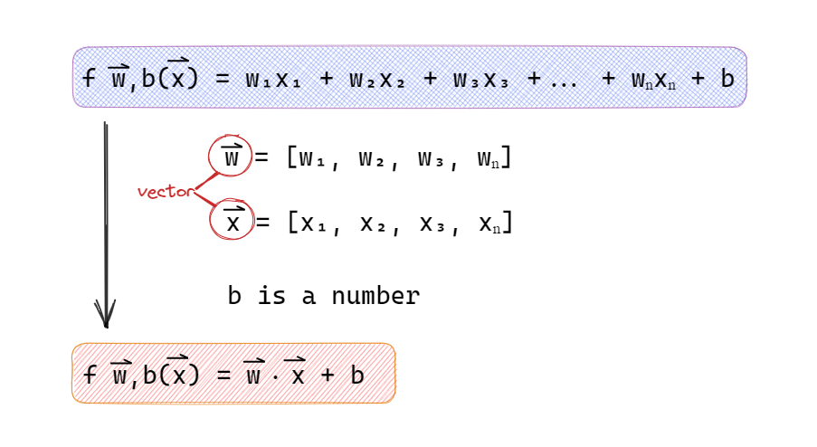

Burada $n$ özellikli bir model tanımı verilmiştir. Bu ifadeyi daha basit hale getirmek için notasyondan bahsedilecektir. Öncelikle $w_1, w_2, w_3$ gibi $n$ adet sayı içeren bir liste olarak tanımlanabilir. Matematiksel olarak buna vektör denir ve bazen üzerine küçük bir ok işareti çizilir. Bu ok işareti, listenin bir vektör olduğunu hatırlatmak için kullanılır. Benzer şekilde, $b$ bir sayıdır ve $x$ de içinde $x_1, x_2, x_3, x_n$ gibi değerler olan bir satır vektördür. Modelin parametreleri $w$ ve $b$'yi içerir. $x$ ise girdi olarak kabul edilir.

Modelin kısa ifadesi şu şekildedir: $f(x) = w·x + b$ . Burada · işareti, $w$ ve $x$ vektörlerinin çarpımını ifade eder. Bu çarpım, $w₁$ ile $x₁$ çarpımı, $w₂$ ile $x₂$ çarpımı, $w₃$ ile $x₃$ çarpımı gibi çiftler halinde yapılır ve sonuçlar toplanır. Matematiksel olarak bu işlem, $w₁x₁ + w₂x₂ + w₃x₃ + ... + wₙxₙ$ şeklinde ifade edilir.

Bu modelin ismi "Çoklu Lineer (Doğrusal) Regresyon" olarak geçer. Bu, tek özellikli regresyonun tersidir, çünkü tek özellikli regresyonda sadece bir özellik kullanılırken, çoklu regresyonda birden fazla özellik kullanılır.

### Vectorization

Vektörleştirme, matris ve vektörlerin kullanımı ile verimli bir şekilde çalışmayı sağlayan bir programlama tekniğidir. Çoklu doğrusal regresyon analizinde vektörleştirme, veri kümesini matris ve vektörlerle temsil etmek, matris işlemlerini kullanarak parametreleri tahmin etmek ve tahmin edilen parametrelerin kullanımı ile sonuçları elde etmek için kullanılır.

Vektörleştirilmiş kod yazmayı öğrenmek, modern sayısal lineer cebir kütüphanelerini kullanmanıza ve hatta belki de GPU (grafik işlemci birimi) kullanmanıza olanak sağlar. GPU, bilgisayarınızdaki grafik işlemleri hızlandırmak için tasarlanmış bir donanım birimidir, ancak vektörleştirilmiş kod kullanarak kodunuzun çalışmasını çok daha hızlı hale getirebileceğinizi gördük.

Şimdi vektörleştirme için bir örneğe bakalım:

$w=[w₁, w₂, w₃]$

$x = [x₁, x₂, x₃]$

b is number

```py
w = np.array([1.0,2.5,-3.3])
b = 4
x = np.array([10,20,30])
```

bu örneğimizde 3 özelliğe sahip bir model oluşturmak istiyoruz. Bunun için python'da bir çok yolu var. Fakat biz modelimizi vektörleştirerek kodu daha hızlı hale getirmek istiyoruz.

**Vektörleştirilmemiş model**
$f w,b(x) = w₁x₁ + w₂x₂ + w₃x₃ + b$

```py
f = w [0] * x[0] +
	w [1] * x[1] +
	w [2] * x[2] + b
```

Her bir w parametresini ona karşılık gelen özelliğin değeriyle çarparız. Şimdi, kodu bu şekilde yazmalısınız ama n değeri 3 yerine 100 veya 100,000 olsaydı? İkisi de hem sizin, hem bilgisayarınız için oldukça verimsiz olacaktır.

**Vektörleştirilmemiş model 2**

```py
f = 0
for i in range (0, len(w)):
	f += w[i] * x[i]

f += b

```

Vektörleştirme kullanmadan bir matematiksel işlemi for döngüsü ile yapmanın bir yolunu açıklar. Bu yöntemde, wⱼ ve xⱼ ifadeleri toplam sembolü kullanılarak toplanır ve b sayısı en sona eklenir. Ancak bu yöntem hala vektörleştirme kullanmadığı için verimli değildir.

**Vektörleştirilmiş Model**

```py
f = np.dot(w,x) + b

```

Vektörleştirme, kodu daha kısa hale getirir ve özellikle büyük n değerleri için çok daha hızlı hesaplamalar yapılmasını sağlar. NumPy'nin dot fonksiyonu, paralel donanım kullanarak işlemi gerçekleştirerek hesaplama verimliliğini artırır. Vektörleştirme, önceki yöntemlere göre daha verimlidir ve kod yazarken zaman tasarrufu sağlar.

**Örnek 1**

Vektörleştirmenin bir örneği olarak, for döngülerinin verimli çalışmasını ele alalım. Geleneksel bir for döngüsü, her bir adımda bir işlem gerçekleştirir ve bu işlemler sırayla gerçekleştirilir. Ancak, NumPy gibi kütüphanelerde vektörleştirme kullanılarak bu işlemler paralel olarak yürütülebilir. Örneğin, bir döngü içinde w ve x vektörlerinin tüm değerlerini çarpmak yerine, vektörleştirme sayesinde bu işlem tek bir adımda tamamlanabilir. Bu, hesaplamaların daha hızlı bir şekilde yapılmasını sağlar.

Vektörleştirmenin önemi, özellikle büyük veri kümeleri veya karmaşık öğrenme modelleriyle uğraşırken daha da belirgin hale gelir. Büyük veri kümelerini veya büyük modelleri işlemek genellikle makine öğrenimi projelerinde karşılaşılan bir durumdur ve vektörleştirme bu tür durumlarda önemli bir adım olabilir. Vektörleştirme, öğrenme algoritmalarının verimli çalışmasını sağlar ve hesaplamaların daha kısa sürede tamamlanmasına yardımcı olur.

Bu nedenle, modern makine öğrenimi algoritmalarını büyük veri kümeleriyle ölçeklendirirken vektörleştirme yöntemlerini kullanmak son derece önemlidir. Vektörleştirme, hesaplamaların daha verimli bir şekilde yapılmasını sağlar ve öğrenme algoritmalarının performansını artırır. Aynı zamanda, kodlar daha okunaklı ve optimize edilmiş hale gelir. Dolayısıyla, vektörleştirme büyük veri kümeleri veya karmaşık modellerle çalışırken kullanılması gereken önemli bir yöntemdir ve modern makine öğrenimi uygulamalarında sıkça kullanılır.

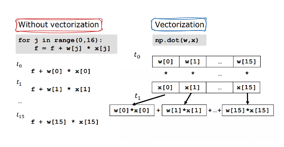

**Örnek 2**

Çoklu doğrusal regresyon uygulamalarında vektörleştirme yöntemlerinin nasıl yardımcı olduğunu somut bir örnekle inceleyelim. Bir sorunu ele alalım: 16 özellik ve 16 parametreye sahip bir çoklu doğrusal regresyon modeli. Bu durumda, 16 parametrenin her biri için bir güncelleme yapmak istiyoruz. Güncelleme için w_j, w_j eksi öğrenme oranı (0.1) ile d_j'nin (1'den 16'ya kadar j için) çarpımını kullanırız.

Vektörleştirme olmadan kod kullanıldığında, bu güncellemeyi her bir parametre için ayrı ayrı yapmak gerekir. Örneğin, w1'i w1 eksi (0.1 çarpı d1) olarak güncellemek için ayrı bir işlem yapılır; ardından w2, w3, ... w16 için aynı işlem tekrarlanır. Bu durumda, 0-15 aralığında j değerleri için bu güncelleme adımları for döngüsü kullanılarak gerçekleştirilir.

Ancak vektörleştirme kullanılarak, bu güncellemelerin tümü aynı anda ve tek bir adımda gerçekleştirilebilir. Vektörleştirme sayesinde bilgisayar, w vektörü ve d vektöründeki tüm değerleri paralel olarak alır, her bir değeri 0.1 ile çarpar ve tüm hesaplamaları aynı anda gerçekleştirir. Bu vektörleştirilmiş kod, NumPy gibi veri yapılarını kullanarak bu hesaplamaları verimli bir şekilde yapar.

Vektörleştirme kullanarak, çoklu doğrusal regresyon modellerinde daha verimli bir uygulama elde edilebilir. Özellikle binlerce özellik veya büyük eğitim veri setleri söz konusu olduğunda, vektörleştirilmiş uygulamaların önemi artar. Bu tür büyük veri setleriyle çalışırken vektörleştirme, öğrenme algoritmalarının çalışma süresini önemli ölçüde azaltabilir.

Vektörleştirme, kodların hızını artırırken aynı zamanda daha okunaklı ve optimize edilmiş bir şekilde çalışmasını sağlar. Vektörleştirme, modern makine öğrenimi uygulamalarında kullanılması gereken önemli ve faydalı bir tekniktir. Öğrenme algoritmalarının etkin bir şekilde uygulanabilmesi ve büyük veri setleriyle ölçeklenebilmesi için vektörleştirme yöntemlerine başvurmak önemlidir

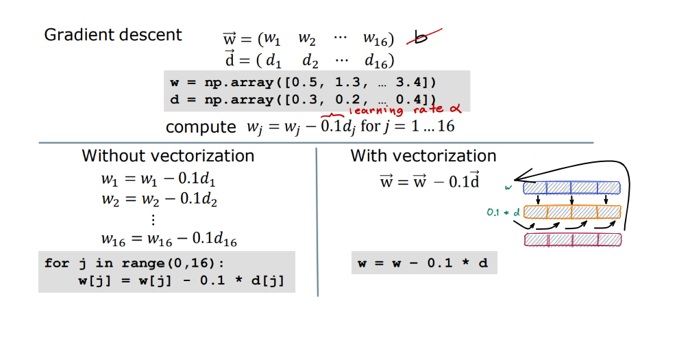

### Multiple Linear Regresyon için Gradiant Descent

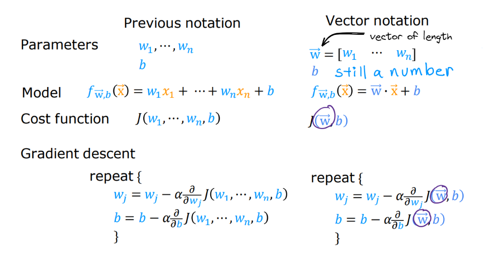

Parametrelerimiz w_1'den w_n'ye ve b'ye kadar değişmektedir. Ancak w_1'den w_n'ye ayrı ayrı sayılar yerine, w'leri bir vektör olarak ele alalım. Bu nedenle şimdi w'yi bir vektör olarak düşüneceğiz ve vektörün uzunluğunu w olarak adlandıracağız. Modeli w vektörü olarak tanımlayacak ve b'yi de yine bir sayı olarak kabul edeceğiz. Önceden gerçekleştirdiğimiz çoklu doğrusal regresyonu, şimdi vektör gösterimini kullanarak, modeli f_w olarak ifade edebiliriz: b'ye ek olarak x vektörü ile w'nin nokta çarpımına eşittir. Nokta çarpımının anlamını unutmamız önemlidir. Maliyet fonksiyonunu J olarak tanımlayabilir ve w_1'den w_n'e ve b'ye kadar olan parametrelerle birlikte yazabiliriz. Ancak J'yi bu parametrelerin bir fonksiyonu olarak değil, ayrı ayrı parametreler w_j ve b ile birlikte bir fonksiyon olarak ifade edeceğiz. Bu w_1'den w_n'e kadar olan bu vektörü W ile değiştirebiliriz ve J artık bu girdiyi alarak w vektörü ve bir sayı olan b'yi çıktı olarak üretmektedir. İşte gradyan inişinin nasıl çalıştığını gösteren bir görüntü. Her w_j parametresini tekrar tekrar güncelleyeceğiz. w_j, alfa ile J maliyetinin türevidir; burada J w_1'den w_n'e kadar ve b'ye sahiptir. Tekrar belirtmek gerekirse, bunu J olarak ifade ediyoruz, w vektörü ve b sayısıyla birlikte.

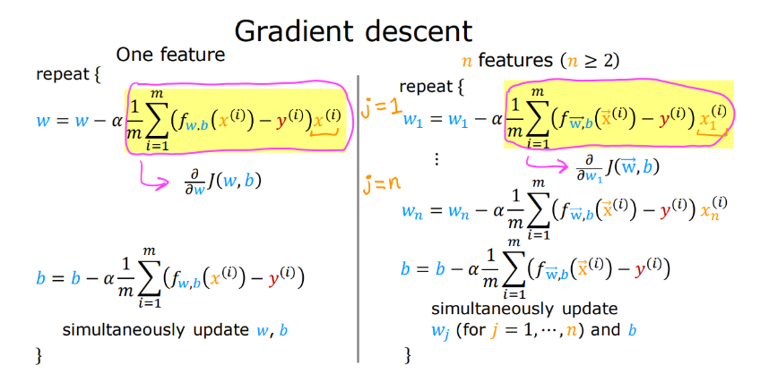

Gradyan inişi ve özellikle türev terimi konusuna bir göz atalım. Gradyan inişi, birden çok özellikle yapıldığında tek bir özellikle karşılaştırıldığında biraz daha karmaşık hale gelir. İşte bu noktada, w için bir güncelleme kuralı ve b için ayrı bir güncelleme kuralı bulunmaktadır. Umarım bu kavramlar size tanıdık geliyor. Burada, J maliyet fonksiyonunun w parametresine göre türeviden bahsediyoruz. Benzer şekilde, b parametresi için de bir güncelleme kuralına sahibiz. Tek değişkenli regresyon durumunda, bu özelliği x_i olarak adlandırırız. Şimdi, n özelliğe sahip olduğumuz bir durumda yeni bir notasyonumuz ortaya çıkar ve n iki veya daha fazla olabilir. Gradyan inişi için bu güncelleme kuralını alırız. w_1'i Alfa çarpı J türevi ile güncelleyelim ve bu formül aslında w_1'e göre J maliyetinin türevidir. Bu türev formülü, tek bir özelliğin durumu için kullanılan türev formülüyle benzerdir, fakat fark, w ve x'in artık vektörler olmasıdır. Ayrıca, sağ tarafta w'ye benzer şekilde, burada x_i'yi x_i_1 olarak adlandırıyoruz. Bu formül sadece J'nin 1 olduğu durumu içerir. Çoklu doğrusal regresyon için, 1'den n'ye kadar değişen J'ye sahip olacağız ve bu nedenle w_1'den w_n'e kadar olan parametreleri güncelleyeceğiz; aynı şekilde b'yi de güncelleyeceğiz. Bu şekilde, çoklu regresyon için gradyan inişini elde ederiz. İşte çoklu regresyon için gradyan inişi bu şekilde gerçekleşir.

### Feature scaling

Bir özelliğin değerleriyle o özelliğin bağlı olduğu parametreler arasındaki ilişkiye bir göz atalım. Somut bir örnek üzerinden ilerleyerek, iki özellikli bir evin fiyat tahminine bakalım. Birinci özellik, evin boyutunu (x1), ikinci özellik ise evin oda sayısını (x2) temsil etsin. Varsayalım ki x1 genellikle 300 ila 2000 feet² arasında değerler alırken, x2 ise 0 ila 5 oda arasında değerler alıyor. Bu örnekte, x1 görece büyük değerler alırken x2 daha küçük değerler alır. Şimdi, 2000 feet² boyutunda ve 5 odalı bir evi ele alalım; bu evin fiyatı da 500 bin dolar olsun.

Fiyatı hesaplarken aşağıdaki denklemi kullanacağız:

$$price = w₁x₁ + w₂x₂+b$$

Burada,

$x₁$: Ev Boyutu (feet²) | Aralığı: 300 - 2,000

$x₂$: Yatak Odası Sayısı | Aralığı: 0 - 5

Eğitim örneğimiz için w1 ve w2 için makul değerlere bir göz atalım. Varsayalım ki w1=50, w2=0.1 ve b=50 olsun. Bu durumda, evin tahmini fiyatı, 100 bin x1'den, 0.5 x2'den ve 50'den oluşan toplamda 100 bin dolar ile 500 bin dolar arasında bir değer olacaktır. Ancak açıkça görüldüğü gibi, bu tahmin gerçek değeri olan 500 bin dolardan oldukça uzaktır.

**1. Durum:**

$w₁= 50, w₂= 0.1, b = 50$

$price = 50 * 2000 + 0.1 * 5 + 50$

$price = 100,050k$

Bu durumda, w1 ve w2 için uygun parametrelerin seçilmediği açıktır. Bu nedenle, başka olası değerlere bakalım. Diyelim ki w1 ve w2 birbirinin tam tersi olsun. Yani w1=0.1 ve w2=50 olsun, b=50 değeri ise sabit kalsın. Bu w1 ve w2 seçimiyle, w1 görece küçük olurken w2 ona göre daha büyük olacaktır, çünkü 50 sayısı 0.1'den büyüktür. Sonuç olarak, tahmin edilen değer 0.1x1 + 50x2 + 50 olarak hesaplanacaktır. Bu ifadeler sırasıyla 200 bin, 250 bin ve 50 olmak üzere toplamda 500 bin dolarlık bir tahmin verir. Bu daha makul bir tahmindir ve evin gerçek fiyatıyla aynıdır.

**2. Durum:**

$w₁= 0.1, w₂= 50, b = 50$

$price = 0.1 * 2000 + 50 * 5 + 50$

$price = 500k$

Gözlemlediğimiz şey şudur: Bir özelliğin değer aralığı büyükse, örneğin ev boyutu 2000 değerine çıktığında, iyi bir model o özelliği öğrenmek için görece küçük bir parametre seçer, örneğin 0.1 gibi. Benzer şekilde, bir özelliğin aldığı değerler küçükse, örneğin evin odalarındaki gibi, o özelliğin parametre değeri görece daha büyük olacaktır.

Peki, bu durumun gradyan inişiyle ne ilgisi var? Bunu anlamak için, evin boyutunu temsil eden x1 ve evin odalarını temsil eden x2 için bir dağılım grafiğine bakalım. Eğitim verilerini grafiğe döktüğümüzde, yatay eksendeki ölçeğin dikey eksene göre çok daha büyük olduğunu fark ederiz.

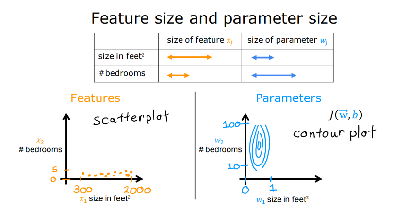

Şimdi, maliyet fonksiyonunun kontur grafiğine bir göz atalım. Geniş bir dikey eksene sahip ve dar bir yatay eksene sahip bir kontur grafiği görüyoruz. Örneğin, yatay eksende 0 ile 1 aralığı, dikey eksende ise 10 ile 100 aralığı olabilir. Bu grafikte gördüğümüz oval veya elips şekilleri, bir tarafı diğer tarafından daha kısa olan şekillerdir. Bu, w1 değerindeki küçük bir değişikliğin tahmin edilen değeri büyük ölçüde etkilediği anlamına gelir. Çünkü w1, evin boyutuyla ilişkilendirilmiş büyük sayılarla çarpılmıştır. Öte yandan, tahmin değerini değiştirmek için w2'de daha büyük bir değişiklik yapılması gerekmektedir. Bu nedenle, w2'deki küçük değişiklikler maliyet fonksiyonunu daha az etkiler.

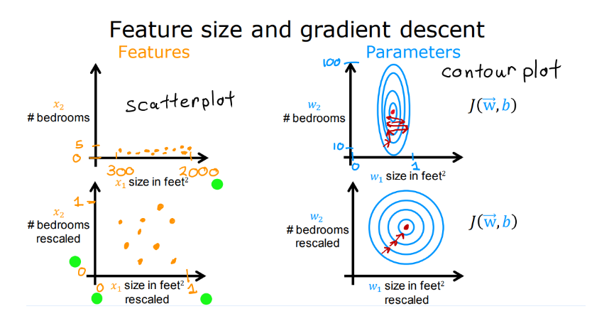

Eğer eğitim verilerinizi olduğu gibi kullanırsanız, bu gradyan inişi süreci üzerinde etkili olabilir. Grafikteki elipslerin uzun ve ince olması nedeniyle gradyan inişi, global minimuma ulaşmak için ileri geri giderek uzun bir süre alabilir. Bu tür durumlarda kullanışlı bir yaklaşım, özellikleri ölçeklendirmektir. Basitçe söylemek gerekirse, eğitim verilerinin değerlerini dönüştürmektir. Örneğin, x1 değerlerini 0 ile 1 arasına, x2 değerlerini de 0 ile 1 arasına ölçeklendirebiliriz. Bu durumda, veri noktaları aşağıdaki gibi görünecek ve grafikteki dağılım daha dengeli ve farklı olacaktır.

Önemli olan nokta, ölçeklenmiş x1 ve x2 değerlerinin artık karşılaştırılabilir hale gelmesidir. Ölçeklenmiş x1 ve x2 verileri üzerinde gradyan inişi çalıştırırsanız, kontür grafiğiniz daha yuvarlak bir şekil alacaktır. Bu sayede, gradyan inişi daha düzgün bir şekilde global minimuma doğru ilerleyecektir.

Özetlemek gerekirse, farklı aralıklardaki özelliklere sahipseniz, gradyan inişi işlemi oldukça yavaşlayabilir. Ancak bu özellikleri karşılaştırılabilir değerlere ölçeklendirirseniz, gradyan inişi daha hızlı ve etkili bir şekilde gerçekleşecektir.

### Gradiant Descent iyi çalıştığı durumlarda: Learning Curve

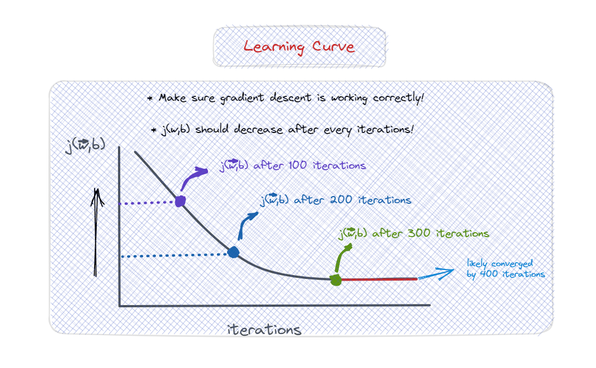

Dereceli azalma kuralı şu şekildedir: Dereceli azalmanın etkili bir şekilde çalışması için doğru bir öğrenme oranı (Alfa) seçimi oldukça önemlidir. Dereceli azalmanın etkinliğini doğrulamak için sıkça kullanılan bir yöntem, J fonksiyonunu grafiğe dökmektir. Bu grafik, eğitim verilerinden hesaplanır ve her bir dereceli azalma adımında (iterasyonda), w ve b parametreleri eş zamanlı olarak güncellenir. Bu grafikte, yatay eksende dereceli azalmanın o ana kadar gerçekleştirilen adım sayısı (iterasyon) gösterilir.

Bu şekilde, bir öğrenme eğrisi elde edebiliriz. Öğrenme eğrisi, dereceli azalmanın iterasyon sayısına bağlı olarak w ve b parametrelerinin nasıl geliştiğini gösterir. Öğrenme eğrisi, her adım sonrasında J maliyetinin nasıl değiştiğini gözlemlemenize yardımcı olur. Dereceli azalma düzgün bir şekilde çalışıyorsa, her adımdan sonra J maliyetinin azaldığını görmelisiniz.

Eğer her adımdan sonra J maliyeti artıyorsa, bunun birkaç nedeni olabilir. Birincisi, öğrenme oranı (Alfa) yanlış bir şekilde seçilmiş olabilir. Alfa çok büyük bir değerse, dereceli azalma yanlış yöne gidebilir ve maliyeti artırabilir. İkincisi, kodda bir hata olabilir.

Öğrenme eğrisine bakarak, dereceli azalmanın ne kadar hızlı yakınsadığını tespit edebilirsiniz. Eğri, iyileşmenin yavaşladığı noktada yakınsama gösterir. Öğrenme eğrisine bakarak, dereceli azalmanın gerektirdiği adım sayısını belirleyebilirsiniz. Bu adım sayısı, uygulamaya ve veri setine bağlı olarak değişebilir. Öğrenme eğrisi, dereceli azalmanın ilerlemesini izlemek için kullanışlı bir araçtır.

### Choosing Learning Rate

Daha somut bir örnek vermek gerekirse, birkaç tekrar için maliyeti grafiğe çizdiğinizde, maliyetin zaman zaman arttığını, zaman zaman azaldığını fark ederseniz, bu, dereceli azalmanın düzgün çalışmadığına dair açık bir işaret olarak kabul edilmelidir. Bu durumda genellikle kodda bir hata olduğunu düşünebilirsiniz veya zaman zaman öğrenme oranınızın çok büyük olduğunu gösterebilir.

İşte bunun nasıl olduğunu gösteren bir örnek:

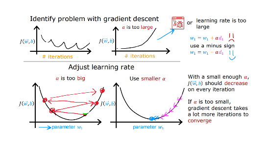

Burada dikey eksende maliyet fonksiyonu J yer alırken, yatay eksende belirli bir parametre (örneğin w_1) olabilir. Eğer öğrenme oranı çok büyükse, başlangıç noktasından hareket ederseniz, güncelleme adımınız minimumu aşabilir ve buraya ulaşabilirsiniz. Sonraki güncelleme adımında ise buraya aşırı yaklaşabilir ve bu durum devam edebilir. Bu nedenle maliyet bazen azalmak yerine artabilir. Bu sorunu düzeltmek için daha küçük bir öğrenme oranı kullanabilirsiniz. Bu durumda güncellemeleriniz buradan başlayacak, biraz düşecek, biraz daha düşecek ve umarım sürekli olarak azalacak ve global minimuma ulaşacaktır.

Bazen her tekrar sonrasında maliyetin sürekli olarak arttığını gözlemleyebilirsiniz, örneğin bu eğride görüldüğü gibi. Bu durum genellikle öğrenme oranının çok büyük olmasından kaynaklanır ve daha küçük bir öğrenme oranı seçerek çözülebilir. Ancak, böyle bir öğrenme oranı aynı zamanda kodda bir sorun olduğunun da bir göstergesi olabilir. Örneğin, kod şu şekilde yazıldıysa: "w_1 güncellemesini w_1 artı Alfa kez bu türev terimi olarak güncelle", bu durumda her tekrar sonrasında maliyet sürekli olarak artabilir. Çünkü türev terimini pozitif işaretle kullanmak, maliyet fonksiyonu J'yi global minimuma daha yakın yerine daha uzağa taşır. Bu nedenle, hatırlayın, eksi işaretini kullanmak istersiniz. Bu durumda kodun şu şekilde güncellenmesi gereklidir: "w_1 güncellemesi w_1 eksi Alfa kez türev terimi olarak güncelle".

Dereceli azalmanın doğru bir şekilde uygulandığından emin olmak için bir hata ayıklama ipucu, yeterince küçük bir öğrenme oranının kullanıldığında maliyet fonksiyonunun her tekrarda azalması gerektiğidir. Bu nedenle, dereceli azalma düzgün çalışmıyorsa, sıkça kullandığım bir yöntemi paylaşmak istiyorum. Öğrenme oranını çok küçük bir değere ayarlayıp, maliyetin her tekrarda azalıp azalmadığını kontrol ederim. Eğer öğrenme oranını çok küçük bir değere ayarlamama rağmen J her tekrarda azalmıyor, hatta bazen artıyorsa, bu genellikle kodda bir hata olduğu anlamına gelir.

Önemli bir nokta olarak, öğrenme oranını çok küçük bir değere ayarlamak burada bir hata ayıklama adımı olarak kullanılmaktadır ve gerçekten küçük bir öğrenme oranı seçmek, öğrenme algoritmanızı gerçekten eğitmek için en verimli seçenek olmayacaktır. Ancak, önemli bir denge vardır; öğrenme oranınız çok küçükse, dereceli azalmanın yakınsaması için birçok tekrar gerekebilir.

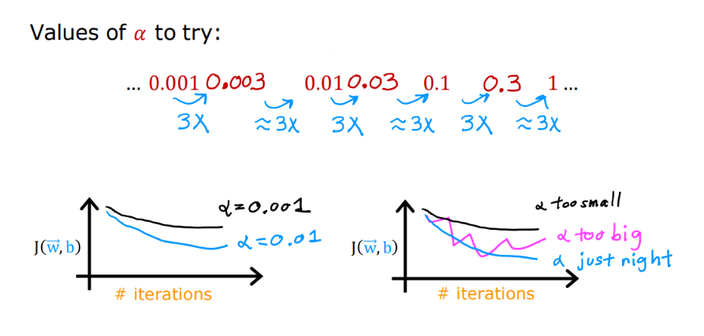

Dereceli azalmayı uygularken genellikle öğrenme oranı olan Alfa için farklı değerler denemeye çalışırım. Örneğin, öğrenme oranını 0.001 olarak deneyebilirim ve ayrıca öğrenme oranını 10 kat daha büyük, örneğin 0.01 veya 0.1 gibi değerler olarak deneyebilirim. Her bir Alfa seçimi için, dereceli azalmayı sadece birkaç yineleme için çalıştırabilir ve maliyet fonksiyonu J'yi yineleme sayısına göre çizdirebilirsiniz.

Farklı değerleri denedikten sonra, öğrenme oranınızın hızlı bir şekilde azalmaya devam ettiği ve istikrarlı olduğu görünen Alfa değerini seçebilirsiniz. Aslında, ben gerçekte bu şekilde bir dizi değer denemekteyim. 0.001'i denedikten sonra, öğrenme oranını üç kat artırarak 0.003 olarak deneyeceğim. Ardından 0.01'i deneyeceğim, bu da 0.003 değerinin yaklaşık üç katı kadar büyük bir değerdir. Yani her Alfa değerini, önceki değerin yaklaşık üç katı kadar büyük bir değer olarak denemeye çalışıyorum.

Bu yöntemle bir dizi değeri deneyerek, hem çok küçük bir değeri belirlemeye çalışıyor hem de çok büyük bir değeri test ederek sonuçları değerlendiriyorum. En yüksek olası öğrenme oranını veya bulduğum en büyük mantıklı değeri seçmeye çalışıyorum. Bu şekilde genellikle modelim için uygun bir öğrenme oranı buluyorum. Umarım bu teknik, dereceli azalma yöntemini kullanırken iyi bir öğrenme oranı seçmenize yardımcı olur.

### Örnek Kod

```py
import numpy as np

class LinearRegression:
    def __init__(self, learning_rate=0.01, n_iters=1000):
        '''
        The class constructor.
        params:
        learning_rate: the learning rate
        n_iters: number of iterations for gradient descent
        '''
        # initialize learning rate (lr) and number of iterations (iters)
        self.lr = learning_rate
        self.iters = n_iters
        # initialize the weights matrix
        self.weights = None
```

```py
    def fit(self, X, y):
        '''
        Used to calculate the weights matrix of the linear regression model.
        :param X: array, features
        :param y: array, known labels
        :return: None
        '''
        n_samples = len(X)
        # modify X by adding a column of ones
        ones = np.ones(len(X))
        features = np.c_[ones, X]
        # initialize the weights matrix
        self.weights = np.zeros(features.shape[1])

        for _ in range(self.iters):
            # predicted labels
            y_predicted = np.dot(features, self.weights.T)
            # calculate the error
            error = y_predicted - y
            # compute the partial derivative of the cost function
            dw = (2 / n_samples) * np.dot(features.T, error)
            # update the weights matrix
            self.weights -= self.lr * dw
```

```py
    def predict(self, X):
        '''
        Makes predictions

        :param X: array, features
        :return: array, predictions
        '''
        # modify X by adding a column of ones
        ones = np.ones(len(X))
        features = np.c_[ones, X]
        # predict the labels
        y_predicted = np.dot(features, self.weights.T)
        return y_predicted
```

### Sklearn ile örnek kod

```py
import numpy as np
import matplotlib.pyplot as plt
from sklearn.linear_model import LinearRegression

# Veri setini oluştur
X = np.array([[1, 2], [2, 4], [3, 6], [4, 8], [5, 10]])
y = np.array([3, 6, 9, 12, 15])

# Modeli oluştur ve eğit
model = LinearRegression()
model.fit(X, y)

# Tahmin yap
X_pred = np.array([[6, 12], [7, 14], [8, 16]])
y_pred = model.predict(X_pred)

# Veri setini ve tahminleri görselleştir
fig = plt.figure()
ax = fig.add_subplot(111, projection='3d')
ax.scatter(X[:, 0], X[:, 1], y, color='blue', label='Veri Noktaları')
ax.scatter(X_pred[:, 0], X_pred[:, 1], y_pred, color='red', label='Tahmin')
ax.set_xlabel('X1 Değerleri')
ax.set_ylabel('X2 Değerleri')
ax.set_zlabel('Y Değerleri')
ax.set_title('Multiple Linear Regression Tahmini')
plt.legend()
plt.show()

```

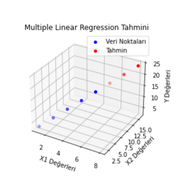
